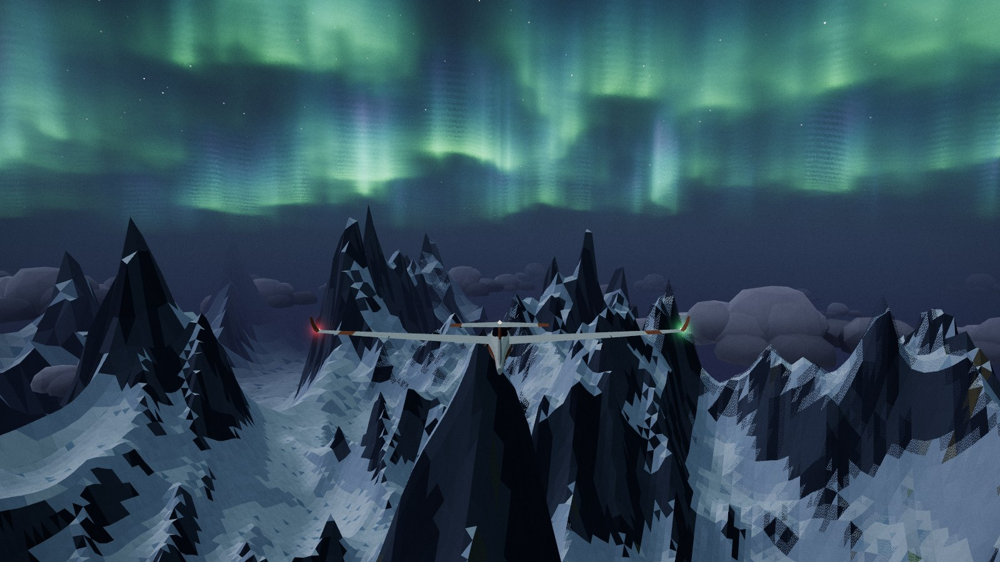
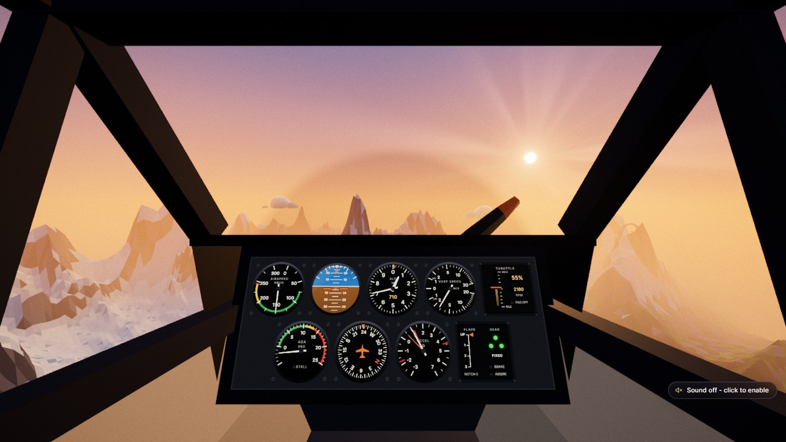
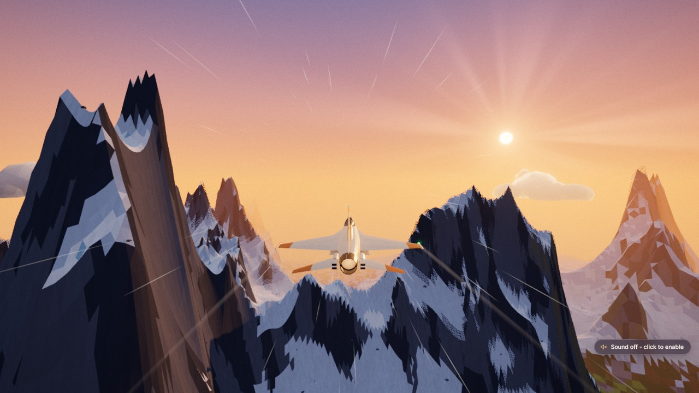
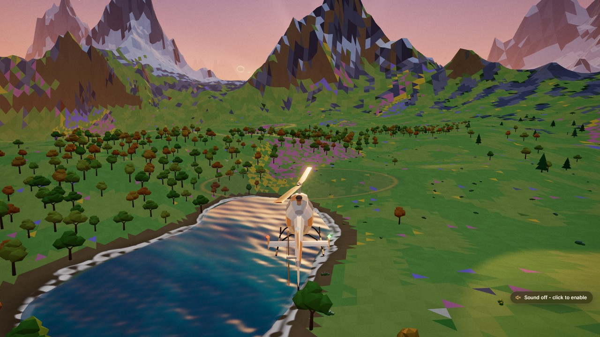
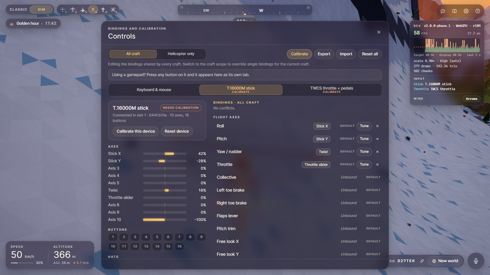

# DRIFTWING

<p align="center">
  <a href="https://kylebuildsai.github.io/driftwing/?seed=D27TEH"></a>
  <a href="https://kylebuildsai.github.io/driftwing/?seed=ARCH1&amp;time=0.02"></a>
</p>

*v1: golden hour over seed D27TEH, and aurora at night over seed ARCH1. Click either shot to fly
that world in your browser.*

> [!NOTE]
> DRIFTWING v1 is a single-shot prompt test of Claude Opus 5.5: it was built from one prompt, with
> no human code edits. v2 is being built in four phases with the same model, one spec prompt per
> phase. This is **v2 Phase 2**: the event director and the first 30 environment spawns, on top of
> Phase 1 (`2.0.0-phase.1`) and the structure correction (tag `v2-structure`), which made V1 and V2
> two separate games behind one launcher. See [About this project](#about-this-project) for how it
> was made.

DRIFTWING is a calm flying game. You fly over an endless world that is made up as you go:
snowy peaks, pine valleys, deserts, island chains and flower meadows, with a sky that lingers at
golden hour. There is no way to lose, no fuel and no enemies. An AI copilot called WREN rides
along. Talk or type to it, and it can set waypoints, fly for you, change the time of day or set up
a ring course.

## What is new in v2 Phase 2

The world now has things happening in it. Phase 2 adds 30 places and events that appear as you
fly, and a reason to go looking for them.

- **Things to find.** Thunderstorms that build and drop tornadoes, waterspouts, lens clouds over the
  peaks, a volcano that wakes now and then, geyser fields, a slot canyon, a huge waterfall, whales,
  a whirlpool, a glowing night bay, starling clouds at dusk, geese, hawks, fireflies, an eagle that
  flies on your wing, wind farms, a rope bridge, an old airfield, meteor showers, a total solar
  eclipse, a comet, a lantern festival, floating islands, a sky whale, crystal spires and a jet
  stream. Sites such as the volcano or the waterfall are always in the same place for the same
  seed; events come and go, and something new turns up within a minute or so of flying.
- **Look at the horizon.** Big things (a storm's anvil, a volcano's plume, a tornado, the sky whale,
  the floating islands) stand on the horizon from 30-60 km away. Fly toward them.
- **The air is part of it.** Many of them change how you fly: a tornado pulls you in, a microburst
  slams you down, lens clouds and geysers lift you, the jet stream and the sky whale's slipstream
  carry you. The assists are still the safety net, and hitting the ground is still only a soft
  restart.
- **Things to do.** Join the end of the geese's V and they follow you, fly under the rope bridge,
  race the slot canyon for a best time, land on the old airfield (the landing is graded) or on top
  of a floating island, and chase a legendary storm for the journal's Storm Chaser entry.
- **Weather.** Each region of the world cycles through clear, building, storm and clearing, and
  the sky and fog follow it. An eclipse really darkens the world, and the birds go quiet.
- **The journal and the map.** A chime and a card greet each discovery, and the journal (J)
  collects them (found / 30) with your records and achievements. The world map (**M**) shows the
  terrain, the places you have found, your trail and the waypoint; click to set a waypoint.
- **WREN as a tour guide.** Ask "what's nearby", "take me to the volcano", "find a thermal", "chase
  the storm" or "next discovery", or use the Guide chips in the command bar. WREN also calls out
  new things ("Supercell building 9 km north-west. Want a heading?"); say "yes" for a waypoint.
- **Share a world.** **Copy link** gives a link that opens your world at your time of day, and a
  seed field in Settings flies any world you type in. The talk-to-WREN key is now **Shift+M**.

The full list of spawns is in [docs/spawns.md](docs/spawns.md), and the changes are in the
[CHANGELOG](CHANGELOG.md).

## What is new in v2 Phase 1

<p align="center">
  
  
  
  
</p>

*The bush plane's cockpit, the jet at golden hour, the helicopter in a hover, and the controls panel
with a Thrustmaster stick connected.*

- **A real flight model.** Lift, drag, stalls, wind, ground contact and landings, for every craft.
  An assists slider (0-100 % per craft) is the only difficulty setting: 100 % by default, and the
  first HOTAS you connect sets 50 % on every craft you have not set yourself. V1, the original
  game, is still one click away: the launcher's **V1 | V2** pill, **F8**, or ask WREN to "switch to
  version one".
- **Six aircraft**, keys **1-6**:
  1. the glider (the v1 plane, flown as a real sailplane);
  2. a bush plane;
  3. a supersonic jet;
  4. a helicopter;
  5. a wingsuit with a parachute;
  6. an FPV racing drone.
- **Joysticks and HOTAS.** Xbox-style gamepads work out of the box, and so does the Thrustmaster
  T.16000M FCS Flight Pack (stick, throttle and rudder pedals). There is a controls panel to rebind
  anything, and a calibration wizard.
- **First or third person.** Fly from the cockpit, with a working instrument panel for each craft
  (the FPV camera on the drone), or from outside in the chase, wing and flyby views, with a glass
  HUD and a flight path marker. V swaps between them, each craft remembers its view, and the view
  never changes how the craft flies.
- **Procedural sound.** Engines, rotors, wind, a stall horn, a variometer and touchdowns, all
  generated live, with no audio files.
- **Wind you can use.** Thermals, ridge lift and gusts, so the glider can climb for real.

## Two games, one launcher

DRIFTWING is two separate games behind one toggle:

- **V1** is the original game, exactly as it was built from one prompt. It is frozen byte-for-byte
  and never changed.
- **V2** is the new game: real flight physics for every craft, first and third person views, HOTAS
  support and everything the later phases add.

The page you open is a small launcher. The game fills the window, and a small **V1 | V2** pill in
the top-left corner switches between them; it hides after a few seconds and comes back when you
move the pointer to that corner. Only one game runs at a time: switching fades out, closes the
running game completely and loads the other. The launcher remembers the game you played last, and
the very first launch opens V2. `http://127.0.0.1:5199/?v=1` and `/?v=2` open a game directly, and a
link with a seed (`/#seed=K7Q2ZD`) is passed on to the game.

The two games keep separate saved data: V2 stores everything under `driftwing-v2` names, V1 keeps
its original ones, and neither touches the other's. The first time V2 starts, it moves the
settings, bindings, calibration and journals saved by Phase 1 over to its own names, once.

## Play it

### On your Windows PC (recommended)

1. **Install Node.js** (the free "LTS" version) from <https://nodejs.org/en/download>. You only do
   this once.
2. **Double-click `start-driftwing.bat`** in this folder. The first time, it downloads what the game
   needs, which takes a minute and needs an internet connection.
3. The game opens in your browser at **<http://127.0.0.1:5199>**. A black window stays open while
   you play; close it to stop the game.

Always play at that exact address. Your settings, key bindings and joystick calibration are saved
in the browser for `http://127.0.0.1:5199` only. The same game at another address (for example
`localhost` or a different port) would start with none of them. That is why the game always uses
port 5199 and refuses to start on another one.

On macOS or Linux, run `npm install` once and then `npm run dev` in this folder, and open
<http://127.0.0.1:5199>.

### Online

The version on GitHub Pages is v1, the original game (the launcher opens the same game at `/?v=1`):
<https://kylebuildsai.github.io/driftwing/>. Share a world by copying the URL; it always carries
the seed, for example <https://kylebuildsai.github.io/driftwing/?seed=K7Q2ZD>.

## Controls at a glance

The full list, including every gamepad and HOTAS button, is in [docs/controls.md](docs/controls.md).
Everything can be rebound in the controls panel (`.`).

| action | keys |
| --- | --- |
| Pitch and bank | mouse (click the view to capture it: a virtual stick that stays where you leave it), arrow keys, A / D |
| Rudder | Q / E |
| Throttle | W / S move the throttle lever, mouse wheel |
| Craft ability | Space (water ballast, smoke, afterburner, hover hold, parachute, drone flight mode) |
| Gear / flaps / airbrake | G / F and Shift+F / hold B |
| Pick a craft | 1-6, or [ and ] |
| Change view | C cycles chase, cockpit, wing and flyby; V swaps the cockpit and your last outside view |
| Waypoint ahead | N |
| Relaunch, engine, parachute | Backspace, Z, U |
| Switch to V1, the original game | F8 |
| Talk to WREN | Shift+M (mic), hold ` (push to talk), Enter or / to type |
| WREN's voice on / off | Shift+V |
| World map | M |
| Photo mode, journal, help | P, J, H |
| Settings, controls panel | `,` and `.` |

- **Mouse:** right-drag looks around, and a middle click recenters the view.
- **Touch:** the on-screen virtual stick and throttle slider fly every craft.
- **Gamepad** (Xbox-style): left stick flies, triggers are the throttle, bumpers the rudder, A is
  the craft ability, and the right stick looks around.
- **HOTAS** (T.16000M + TWCS + TFRP):
  - the stick flies, and its twist is the rudder until the pedals move;
  - the throttle lever is the throttle (the collective on the helicopter);
  - the pedals and toe brakes steer and brake;
  - the rocker trims, the antenna slider sets flaps or zoom, and the mini-stick looks around;
  - the trigger is push-to-talk, the stick hat snaps the view, and base button 10 switches to V1.

## Settings

Open Settings with `,` or the gear icon. There are five tabs:

- **Flight**:
  - the assists slider for the current craft (the only difficulty control);
  - start on the ground (for take-off practice);
  - units (km/h and metres, or knots and feet);
  - the HUD: the glass HUD in the cockpit, the flight path marker, the instrument overlay and
    landing callouts;
  - the FPV drone's camera tilt (0-40 degrees), stick expo and maximum rotation rate.
- **Graphics**: quality preset, frame target (Auto uses your screen's refresh rate), dynamic
  resolution, FPS display, and the field of view for each camera.
- **Sound**: master volume and a mixer for engine, environment, interface, WREN and music.
- **Controls**:
  - mouse sensitivity and invert pitch;
  - HOTAS options: twist yaw and the afterburner detent;
  - buttons that open the controls panel and the calibration wizard.
- **General**:
  - day length and freezing time;
  - WREN's voice, chatter, tour-guide callouts and remote brain;
  - the world: Copy link, and a seed field that flies another world;
  - developer tools (status badge, wind arrows).

Everything is saved in the browser for `http://127.0.0.1:5199` (in V2's own `driftwing-v2`
database) and survives restarts.

## WREN, the copilot

WREN's default brain is a local keyword grammar and needs no network. Speak with the mic button
or Shift+M (Web Speech API; Chrome and Edge), hold the backquote key or the HOTAS trigger to talk,
or type into the command bar. Things to try:

- "Where am I?", "Find mountains", "Take us there", "Set a waypoint", "Autopilot on", "Head west"
- "Make it night", "Golden hour", "Ring course", "Photo mode", "Journal"
- "Switch to the helicopter", "Assists down", "Cockpit view", "Deploy chute", "Engine off",
  "Relaunch", "Calibrate controls", "Airspeed", "How was my landing?", "Switch to version one"
- "What's nearby?", "Take me to the waterfall", "Find a thermal", "Chase the storm", "Next
  discovery", "Guide help", and "yes" when WREN offers a heading; "Callouts off" quiets the
  callouts

**Remote brain.** `RemoteCopilot` can send each request to your own HTTP endpoint (for example one
backed by a language model) and falls back to the local grammar after 800 ms. A reference server
is included:

```bash
npm run copilot-server
```

In Settings, General, turn on **Remote brain** and keep the endpoint
`http://localhost:3000/copilot`. If port 3000 is reserved on your machine (common on Windows with
Hyper-V or WSL), run the server on another port, for example `PORT=3300 npm run copilot-server`, and
change the endpoint to match.

The server answers from its own rules. If `ANTHROPIC_API_KEY` is set in its environment, it asks
Claude first (model from `COPILOT_MODEL`, default `claude-haiku-4-5`). The key never reaches the
browser, and the server only answers the game's own origins. The full contract is in
[docs/copilot-api.md](docs/copilot-api.md).

## The single-file build

```bash
npm run build:single
npm run serve:single
```

The first command writes `dist-single/`: the launcher shell as one self-contained `index.html`,
V1 copied byte-for-byte to `v1/index.html` (its SHA-256 is checked against `tests/v1.sha256`), and
V2 as one self-contained `v2/index.html` with everything inlined, including the terrain worker
(`tools/build-single.mjs` runs one build per page). The second serves it at
<http://127.0.0.1:5199>, the same address as the game, so it uses the same saved settings. Stop the
dev server first, since both use port 5199. Serve the files from a local web server rather than
opening them directly: the shell loads the games from /v1/ and /v2/. The folder can also be copied
to any static web host, but bindings saved there belong to that site.

## URL parameters

The launcher reads `v` and passes every other parameter, and any `#hash`, on to the game, so
`/?v=2&renderer=webgl` and `/#seed=K7Q2ZD` work from the launcher too.

| parameter | example | effect |
| --- | --- | --- |
| `v` | `?v=1` | launcher only: open V1 (`1`) or V2 (`2`), and remember it |
| `#seed` | `#seed=K7Q2ZD` | the seed in the hash, as the launcher forwards it and share links carry it (`?seed=` wins when both are given) |
| `#t` | `#seed=K7Q2ZD&t=0.723` | with a seed link: the time of day, as a fraction of the day or `HH:MM` (`?time=` wins when both are given) |
| `seed` | `?seed=K7Q2ZD` | Fly a specific world. The URL always carries the current seed, so you can share it |
| `time` | `?time=0.02` | Start at a time of day from 0 to 1 (0 is midnight, 0.25 sunrise, 0.5 noon, 0.75 sunset) |
| `renderer` | `?renderer=webgl` | Force the WebGL2 fallback |
| `debug` | `?debug=1` | Show the dev badge and log the backend and every controller's id to the console |
| `dev` | `?dev=1` | In a production build: the spawn debugger on F9 (dev builds always have it) |
| `touch` | `?touch=1` | Force the on-screen touch controls |

## Troubleshooting

| problem | what to do |
| --- | --- |
| **"Node.js is not installed"** or the window closes at once | Install the LTS version from <https://nodejs.org/en/download>, then double-click `start-driftwing.bat` again. The script opens that page for you when Node is missing or older than version 20 |
| **Port 5199 is already in use** | DRIFTWING is probably already running: open <http://127.0.0.1:5199>, or close the other black DRIFTWING window first. If another program uses port 5199, close it. The game does not move to another port on purpose, because your saved settings belong to this one |
| **No sound** | Browsers only allow sound after you click or press a key. If a "Sound off - click to enable" pill appears (bottom right), click it. Then check the volumes in Settings, Sound |
| **WebGPU or WebGL2?** | The game uses WebGPU when your browser and graphics driver support it (current Chrome and Edge), and switches to WebGL2 by itself otherwise. Both look and play the same. The status badge (Settings, General, or `?debug=1`) shows which one is running. Add `?renderer=webgl` to force WebGL2 if WebGPU misbehaves on your machine. If the game shows "could not start", update the browser |
| **The HOTAS or gamepad is not detected** | Browsers hide controllers until you **press a button** on each one while the game tab is focused. The controls panel (`.`) says "Press any button on your stick and throttle" until both appear. Use Chrome or Edge, and plug the pedals into the throttle before plugging the throttle into USB. `?debug=1` logs each controller's id in the console (F12) |
| **The joystick drifts or feels wrong** | Run the calibration wizard (controls panel, **Calibrate**) with the stick centred and your feet off the pedals, and move every axis to its limits. The steps are in [docs/controls.md](docs/controls.md#calibration-wizard) |
| **Settings or bindings disappeared** | Check that the address bar says exactly `http://127.0.0.1:5199`. Private windows do not keep saved data |
| **The mic does not work** | Voice needs Chrome or Edge and microphone permission. Typing to WREN always works |

## For developers

### Scripts

| command | what |
| --- | --- |
| `npm run dev` | Vite dev server at <http://127.0.0.1:5199> (strict port) |
| `npm run build` | production build into `dist/`: the shell `index.html`, `v1/index.html` (copied untouched) and `v2/index.html` |
| `npm run build:single` | `dist-single/`: the shell, `v1/` and `v2/`, each one self-contained file |
| `npm run preview` | serves `dist/` at <http://127.0.0.1:5199> |
| `npm run serve:single` | serves `dist-single/` at <http://127.0.0.1:5199> (`tools/serve.mjs`, no dependencies) |
| `npm run copilot-server` | the reference remote brain for WREN |
| `npm test` | checks the V1 freeze, builds `dist-single/` and runs the headless smoke test on the shell |
| `npm run test:v1` | fails if `public/v1/index.html` differs from `tests/v1.sha256` or from `git show v1-final:index.html` |
| `npm run test:shell` | builds `dist-single/`, then runs the launcher shell test against the dev server and the build (`tools/shell-test.mjs`) |
| `npm run test:flight`, `test:flight:webgl` | the flight-test harness (every craft, first and third person, 3 seeds) on WebGPU or WebGL2 |
| `npm run test:hotas`, `test:hotas:webgl` | the HOTAS pipeline harness on WebGPU or WebGL2 |
| `npm run test:terrain`, `test:terrain:webgl` | the terrain stamps in the running game: no cracks at any LOD, worker meshes equal to main-thread builds, collision within 0.5 m |
| `npm run test:terrain:real`, `test:terrain:real:webgl` | the same terrain test on the game's own stamped sites (seed `TERRAIN-REAL-8`, all six stamp types) |
| `npm run test:spawns`, `test:spawns:webgl` | the spawns test: each of the 30 presets force-spawned ahead of the craft, photographed, and disposed back to its GPU memory, wind source and heap baselines |
| `npm run test:determinism`, `test:determinism:webgl` | the determinism test: the same seed and path in two page loads, with identical site lists and director logs |
| `npm run test:soak`, `test:soak:webgl` | the 10-minute soak: 5 seeds, first and third person, the event director live |
| `npm run lab:terrain` | site placement and terrain stamps headless, including the height-sampling cost against Phase 1 |

three.js is pinned to exactly `0.184.0` and imported only as `three/webgpu`, `three/tsl` and
`three/addons/...`, so there is one copy. Vite `7.3.6` and `vite-plugin-singlefile` build it.

### Folder layout

```
index.html               the launcher shell: the game iframe and the V1 | V2 pill
v2/index.html            V2's page: glass UI markup
public/v1/index.html     V1, the original single-file game, frozen byte-for-byte
src/shell/               the launcher shell's script, and V2's bridge to it (versionToggle)
src/main.js              V2's composition root: boot, systems, frame loop
src/core/                config, storage (IndexedDB), settings, events, fixed-step clock, frame loop, perf
src/render/              renderer boot, post stack, sky, clouds, water, birds, effects
src/world/               world generator (shared height function), site placement and terrain stamps, terrain and map-tile workers, landmarks
src/flight/              flight controller, flight models, assists and their defaults, autopilot, trim, ground contact
src/craft/               craft registry and the six craft modules
src/input/               InputManager, keyboard / mouse / touch, gamepad and HOTAS, bindings, calibration
src/camera/              camera manager, chase rig, cockpit, wing, flyby and FPV views
src/audio/               AudioEngine, mixer, engine synths, cues, callouts, spawn voices and their recipes
src/env/                 WindField
src/spawns/              the spawn manager, event director, regional weather, the ten engines and the 30 presets
src/ui/                  glass UI, craft picker, settings, controls panel, instruments, journal, world map, discovery card
src/copilot/             WREN: local grammar, remote brain, aircraft actions, tour guide
src/gameplay/            journal, ring courses, waypoints
src/dev/                 dev badge, wind overlay, spawn debugger (F9), debug wind source, mock gamepads, test harnesses and kits
tools/                   smoke test, shell test, harness runner, flight, engine and system labs, docs check, builds, copilot server, static server
tests/                   the V1 freeze test and its SHA-256
docs/                    architecture, spawns, the engine pages, controls, copilot API, V1's known issues, the owner specs, screenshots
start-driftwing.bat      one-click start for Windows
```

### Tests, labs and harnesses

- **Smoke test.**
  `node tools/smoke-test.mjs --file dist-single/index.html [--query "renderer=webgl"] [--steps-file steps.json] [--out dir]`
  loads the game in headless Chrome or Edge (set `CHROME_PATH` if the browser is elsewhere). It
  fails on any console error or warning, runs scripted steps (`wait`, `press`, `down`, `up`,
  `click`, `move`, `eval`, `shot`), and saves screenshots. `window.DRIFTWING` exposes `ready`,
  `ctx`, `state` and `getStats()` for scripted checks. `tools/steps/env-fixes.json` is a ready
  step file: WREN's start view, the seeded wind, doppler across a view cut, leaving photo mode into
  a chase view chosen meanwhile, and the jet's contrails in level cruise (read the `evals` in the
  report).
- **Flight labs.** `node tools/flight-lab.mjs` covers the glider and bush plane, and
  `node tools/lab/jet.mjs` (also `helicopter.mjs`, `wingsuit.mjs`, `fpv.mjs`) the others. They fly
  the flight models headless and check them against their targets. `node tools/lab/storage.mjs`
  checks saved data against a hung or closed IndexedDB, `node tools/lab/settings.mjs` the settings
  migrations and the one-time HOTAS assist default, `node tools/lab/copilot.mjs` WREN's grammar,
  and `node tools/lab/copilot-server.mjs` which origins the copilot server accepts.
- **Shell test.** `node tools/shell-test.mjs [--target dev,dist] [--backend webgl]` switches
  between the games 20 times each way in headless Chrome, against the dev server and the built
  `dist-single/`. It checks that one game document is ever live, that memory (JS heap, DOM
  counters and Chrome's GPU process) returns to its first-load level, that the focus lands in the
  game, that `/#seed=ABC` reaches V2, and that a page on another port cannot switch games. It
  prints a PASS / FAIL table and writes a JSON report. `node tools/shell-check.mjs --url <shell>`
  checks the pill and persistence.
- **Test harnesses** (dev server only).
  - `?test=1` flies all six craft in first and third person across three seeds (36 runs) and
    reports fps, frame times, NaN events, terrain penetrations, soft crashes and heap growth.
  - `?test=hotas` checks the HOTAS pipeline, persistence across a reload and the HOTAS assist
    default with mock devices.
  - `?test=terrain` checks the terrain stamps for cracks at every LOD and collision against the
    rendered mesh (`--presets real` runs it on the game's own stamped sites).
  - `?test=spawns` force-spawns each of the 30 presets ahead of the craft at a time of day and in
    weather that suit it, records its frame times, frames a screenshot, and checks that disposing
    it gives back its GPU memory, wind sources, lights and sky modifiers, with the JS heap within
    1 MB over three held create and dispose cycles.
  - `?test=determinism` flies the same seed and scripted path in two page loads and needs an
    identical site-list hash and director activation log.
  - `?test=1&testPlan=soak` is the 10-minute soak: 5 seeds, one craft each, first and third
    person, the event director live; 0 NaN, 0 penetrations, heap growth under 75 MB, p99 within
    the frame target and no frame over 50 ms after warmup.
  - `node tools/run-harness.mjs --test 1|soak|hotas|terrain|determinism|spawns [--backend webgl] [--views first,third]`
    runs one headlessly. For every frame over 50 ms it also records what the rest of the machine
    was doing at that moment: other programs' CPU and GPU load against the harness's own (named
    per program on Windows), the whole machine's CPU and the GPU's utilisation.
- **Spawns.** `node tools/lab/spawns.mjs`, `director.mjs`, `terrain.mjs`, `audio.mjs`,
  `discovery.mjs`, the engine labs (`wind-engines.mjs`, `structure.mjs`, `setpiece.mjs`) and the
  preset labs (`preset-pacing.mjs`, `preset-flight.mjs`, `preset-wind.mjs`) check the spawn
  framework, the director, placement and stamps, the spawn sound, the discovery loop, the engines
  and the 30 presets headless. `tools/spawn-check.mjs` and the step files in `tools/steps/`
  (`engine-*.json`, `presets-*.json`, `discovery.json`, `copilot-guide.json`) check them in the
  running game on a dev server; `docs/architecture.md` lists each one.
- **Docs check.** `node tools/docs-check.mjs` checks every relative link and anchor in the docs,
  that `docs/spawns.md` matches the preset files, that its preset templates are valid presets, and
  that every wind source param is documented.

### Documentation

- [docs/architecture.md](docs/architecture.md): the module map, the frame loop, every system
  contract (placement, stamps, the spawn engines and the director included), and where Phases 3-4
  plug in.
- [docs/spawns.md](docs/spawns.md): the 30 spawn presets with their engines, filters, rarity and
  wind, and templates for adding a new one.
- [docs/engines/](docs/engines/): one reference page per spawn engine, with every param.
- [docs/controls.md](docs/controls.md): every default binding, calibration, and a HOTAS hardware
  checklist.
- [docs/copilot-api.md](docs/copilot-api.md): the remote copilot request, response and action
  schema.
- [docs/v1-known-issues.md](docs/v1-known-issues.md): what the frozen V1 prints, recorded instead
  of fixed.
- [CHANGELOG.md](CHANGELOG.md): what changed in each version.

## Known limitations

- The first click or key press unlocks audio. Creating the browser's AudioContext can take around
  0.1 s on some machines, so a single frame may stutter at that moment.
- The WebGL2 fallback takes a few seconds longer to start than WebGPU, because WebGL compiles its
  shaders synchronously.
- When the auto-hidden HUD fades back in (a toast, the autopilot switching, the chute opening),
  Chrome rasterizes it on its GPU process's main thread, the thread that also runs WebGPU: about
  20-40 ms of work spread over a few frames. On an idle machine the slowest of those frames
  measured 18-38 ms; on a machine busy with other programs one of them can pass 50 ms.
- The Thrustmaster product ids and button numbers are the published ones and have been tested with
  mock devices. The first session with the real hardware should follow the checklist in
  [docs/controls.md](docs/controls.md#hotas-hardware-checklist). Every binding can be changed in
  the controls panel if a button reports differently.
- Voice input uses the Web Speech API, which works in Chrome and Edge and needs microphone
  permission.

## About this project

DRIFTWING started as a single-shot prompt test of **Claude Opus 5.5**, run to gauge the model's
quality and ability on a large, open-ended build. v1 and its tooling came from one prompt,
reproduced below. Working in Claude Code, Opus 5.5:

- planned the architecture and wrote a module contract;
- researched the pinned three.js r184 WebGPU and TSL APIs against the library source;
- split the work across parallel sub-agents, then reviewed, fixed and polished the result;
- verified it in headless Chrome on both WebGPU and WebGL2.

No person wrote or edited any of v1's code. The session did pause twice at usage limits and resumed
with a plain "continue". Every later message only asked to publish the finished game: this
repository, GitHub Pages, the release, the topics, the v1 screenshots and this note. v1 is tagged
`v1.0.0` and kept, frozen byte-for-byte, as [public/v1/index.html](public/v1/index.html).

**v2** is being built in four phases with the same model, each from one spec prompt:

1. **Phase 1**: the sim core, HOTAS, the first six craft, cockpits and procedural audio.
2. **Phase 2 (this version)**: an event director with ten spawn engines, the first 30 environment
   spawns, and the discovery loop (journal, tour guide, world map, seed links).
3. **Phase 3**: more craft.
4. **Phase 4**: Spotify, WebXR VR, a flight recorder with replay, and a multiplayer wingman.

For Phase 1, Opus 5.5 turned the single file into a Vite project and built the new systems with
parallel sub-agents in separate git worktrees, one merge per milestone, and reviewed and verified
each wave. A structure correction then made DRIFTWING two separate games behind one toggle: V1
frozen byte-for-byte, and V2 flying only the real flight model (Phase 1's CLASSIC mode, a port of
v1's arcade flight inside V2, was removed). The Phase 1 screenshots
above were captured from the single-file build with the headless smoke-test tool. Phase 2 was
built the same way: placement, the engine framework, the director and the spawn audio first, then
the ten engines, the 30 presets in three verified batches, and the discovery loop, each wave on
its own worktrees and merged per milestone.

<details>
<summary>The original v1 prompt</summary>

```text
Build a complete, self-contained browser game in a SINGLE index.html file. No build step, no external assets, libraries only via CDN importmap. Use three.js (latest) with WebGPURenderer and automatic WebGL fallback.
THE GAME: "DRIFTWING", an ambient infinite-flight exploration game. You pilot a low-poly glider over an endless procedural world. No fail state, no fuel, no enemies. The fantasy: a golden-hour flight that never has to end, with an AI copilot riding shotgun.
FLIGHT MODEL (arcade with soul):
- Mouse steers pitch and roll (WASD/arrows also work), scroll or W/S for throttle, space for a gentle boost on cooldown
- Banking turns: rolling into a turn induces natural yaw; speed bleeds in climbs and builds in dives
- Soft stall: below minimum speed the nose eases down, never a tumble
- Chase cam with smooth lag that banks with the plane, FOV stretches with speed, subtle shake at max velocity
- Touch support: virtual joystick plus throttle slider
- Double-tap A or D triggers a smooth canned barrel roll
INFINITE TERRAIN (the engineering core):
- Chunked heightmap terrain from seeded simplex noise, multiple octaves, fully deterministic from a seed shown in the UI so worlds are shareable
- Biomes blended by temperature/moisture noise: snow peaks, pine valleys, dunes, archipelago ocean, flower meadows; vertex-colored, flat-shaded low-poly
- Chunk generation in a Web Worker with transferable buffers, ring LOD (high detail near, low far), pooled and recycled chunk meshes, zero frame hitches while streaming
- Stitched LOD edges or skirts so there are never visible cracks
- Procedural landmarks every few km: stone arches, monolith circles, a lighthouse on a lone island, drifting hot air balloons; discoveries log to a journal
LIVING ATMOSPHERE:
- Day/night cycle (6 min loop, settable): sun, moon, star field, dawn/dusk gradients, aurora over snow biomes at night
- Sky: gradient dome with a sun disc and cheap radial god rays near the horizon; fog color always matches the sky
- Clouds: instanced soft puffs in a slow-drifting layer casting faint shadow blobs
- Water: animated vertex waves, sun glint streak, foam band at shorelines
- Boid bird flocks that scatter when you dive through them
- Wingtip contrails when banking hard, wind streak lines at speed
THE COPILOT (critical architecture):
- class Copilot { async respond(flightState, transcript) -> { speech, action } }
- Default brain = local keyword grammar via the Web Speech API: "where am I", "find mountains / ocean / desert", "set waypoint", "autopilot on/off", "make it night / dawn", "barrel roll", "ring course"
- Executable actions: place a glowing waypoint beacon, autopilot to a heading, change time of day, spawn a ring course, describe current biome and altitude
- RemoteCopilot: POSTs { flightState, transcript } to a configurable endpoint (default http://localhost:3000/copilot), expects { speech, action } back, falls back to the local grammar after an 800ms timeout
- Copilot answers via speechSynthesis plus a subtitle line in the glass UI; mic toggle with a pulsing listening indicator; every command also reachable by keyboard/UI so voice is never required
GENTLE OBJECTIVES (optional, never nagging):
- Ring courses on request: fly-through rings with chime feedback, time and best streak
- Discovery journal: biomes visited, landmarks found, distance flown, max altitude
- Photo mode: P pauses, frees the camera, hides UI, adds letterbox and a screenshot button
VISUAL QUALITY BAR (this is the entire point):
- Cohesive 6-color palette per biome, flat shading, soft sun shadows
- Post stack: subtle bloom, vignette, warm color grade, light film grain
- Golden-hour default start: long shadows, warm fog, the screenshot moment inside the first 5 seconds
- Minimal glass UI: altitude, speed, compass strip, waypoint arrow, world seed, mic toggle; auto-hides after 3 seconds of stillness
PERFORMANCE:
- 60fps target on desktop: frustum culling, instancing for trees/rocks/clouds, worker-side terrain, auto-degrade view distance before frame drops
- Guard against: LOD cracks, falling through unloaded chunks (clamp altitude to terrain height plus epsilon), NaN attitude, worker backlog, tab-blur dt spikes
POLISH RULES:
- Every listed system must actually function, zero placeholders
- Opens already airborne at golden hour with a 1-second fade, no menu wall, no console errors
```

</details>

One deliberate departure from the v1 prompt: it asks for the latest three.js, but the project pins
r184. That is the version the author's build standards had verified, and pinning keeps the WebGPU
and TSL APIs from shifting underneath the game. v2 keeps the same pin, now as an npm dependency.

No binary assets: everything, including the aircraft, trees, landmarks and sounds, is generated in
code.
